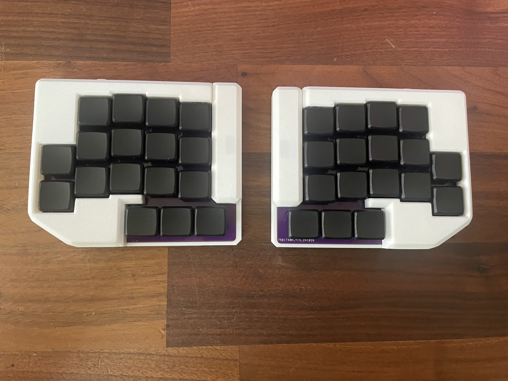
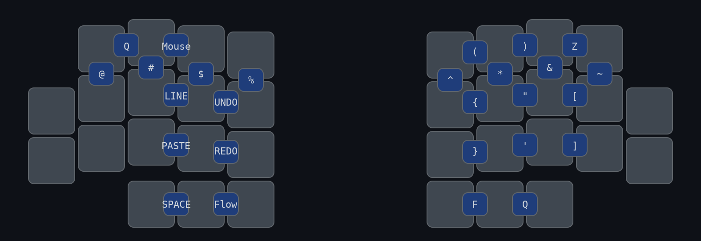
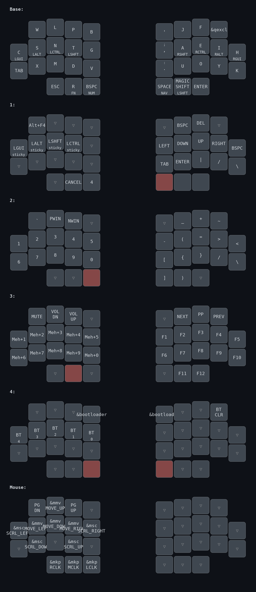

# My Personal zmk config

Personal documentation of my zmk config to figure out what I prefer and can optimize. Currently using a hands down promethium personal variation for letters. Utilizing a 34 keyboard layout with the catpucciano

## Highlights 

- Incorporates many features from [urob's config](https://github.com/urob/zmk-config)
    - Timeless Homerow Mods
    - Magic Shift
    - Smart Mouse
    - Alt-tab swapper with [tri-state](https://github.com/dhruvinsh/zmk-tri-state)
    - Vertical combos for number symbols
    - Mod morph for comma->semi, dot->colon, qmark->!
- Didn't like comboing for all symbol, reverted smart num to lt to fit backspace on thumb
    - allows easy rolling of symbols for =>, += , {} 
    - fits most common symbols on homerow   

## Hands Down Layout
- AU,EO,YI Block on right hand
- C,S,N,T Homerow on left, R on thumb (worst sfb key)
- PTDB index , LNM columns for minimal SFB
- J & F above vowels felt most comfortable for me & allows some better vim motion usage compared to f on bottom ring and j on diagonal index
    - Can possibly move k to a better position for vim motion  

## Combos

## Layout
